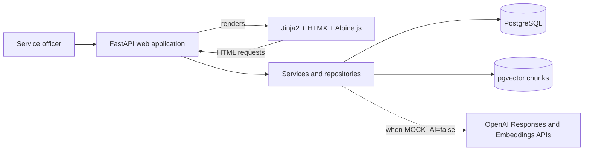

# Architecture

Phase 1 establishes the process boundaries; this document will be expanded as components are implemented.

Commercial calculations remain inside backend services using SQL facts; the AI boundary handles only cited technical interpretation and explanation.
